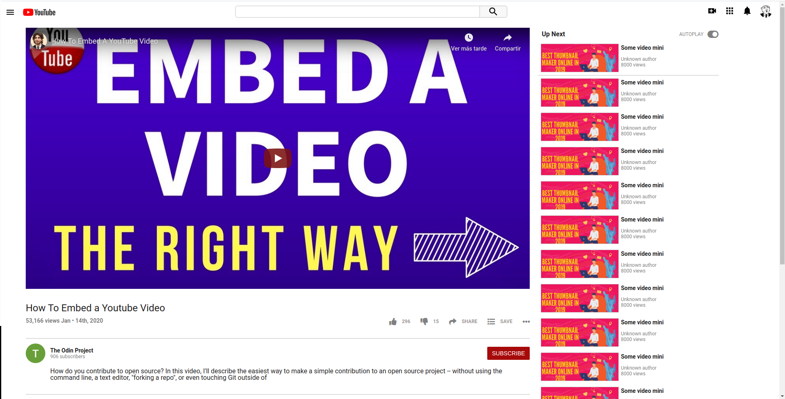

# Embedding Images and Video

> This project tries to make a clone from youtube layouts using  flexbox.

Additional description about the project and its features.

## Built With

- CSS and HTML
- Flexbox

## Live Demo

[Live Demo Link](https://embedding-images-and-video-rs.000webhostapp.com/)

## Getting Started

**This is a static page and was made using  CSS & HTML, you don't need .**
**anything to start up this page, is already published in a public repository so you can check the final result. For a better understanding of the code read about FlexBox.**

## Authors

👤 **Author1**

- Github: [@githubhandle](https://github.com/githubhandle)
- Twitter: [@twitterhandle](https://twitter.com/twitterhandle)
- Linkedin: [linkedin](https://linkedin.com/linkedinhandle)

👤 **Author2**

- Github: [@rubenpazch](https://github.com/rubenpazch)
- Linkedin: [rubenpch](https://www.linkedin.com/in/rubenpch/)

## 🤝 Contributing

Contributions, issues and feature requests are welcome!

Feel free to check the [issues page](issues/).

## Show your support

Give a ⭐️ if you like this project!

## Acknowledgments

- Hat tip to anyone whose code was used
- Inspiration
- etc

## 📝 License

This project is [MIT](lic.url) licensed.
